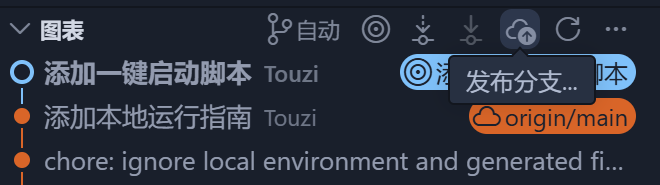
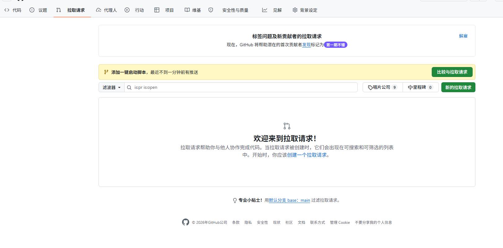
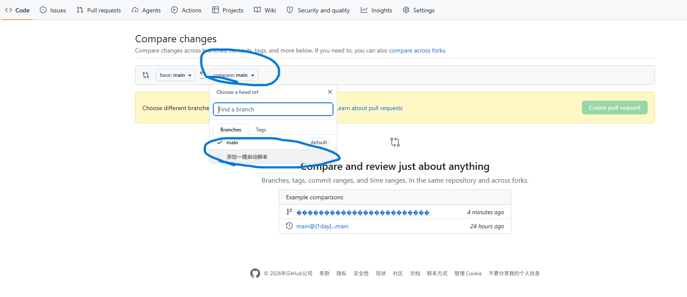
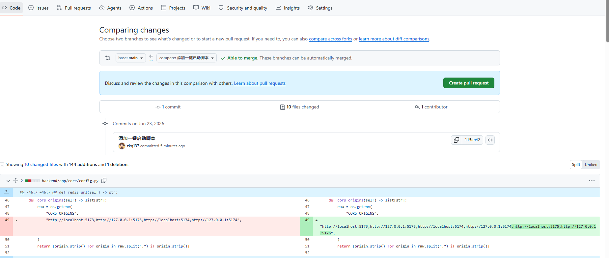
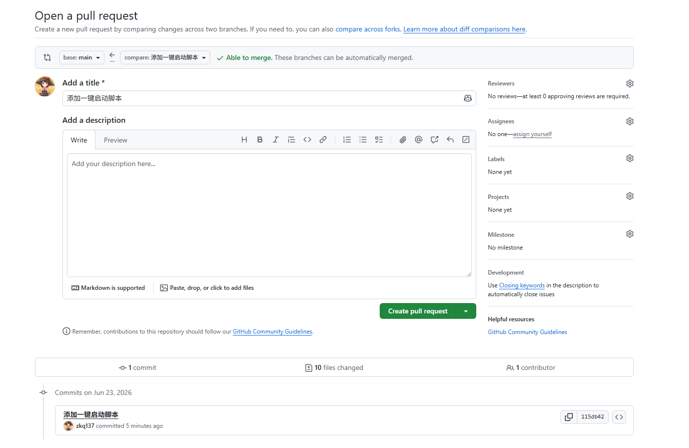
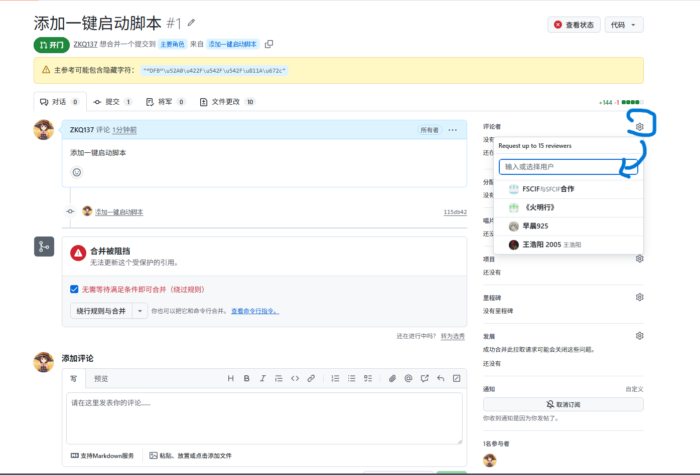

main分支设置了分支保护，不能直接推送。
合并代码通过提交pr合并分支进行，方便进行代码审核，避免冲突。

开发新功能前先拉取最新进度。

创建分支

从main中创建分支

创建分支后，在分支中开发代码。
**注意：** 本地测试确认代码运行正常后才能提交。
提交信息中填写新增内容和改动，提交代码

提交后推送分支到云端

点击新的拉取请求创建pr

选择要提交的分支

点击绿色按钮创建

输入pr描述，点击绿色按钮创建

选择审核人，选朱坤奇的号

审核成功后朱坤奇会合并分支，这时候会自动删除分支。
之前开发用的分支最好不要再使用，开发新内容时再从main创建新的分支
点击签出到

选择main分支

拉取最新进度

